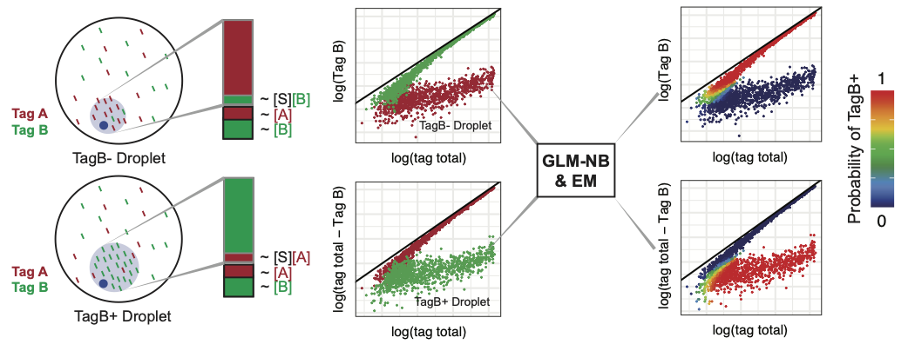
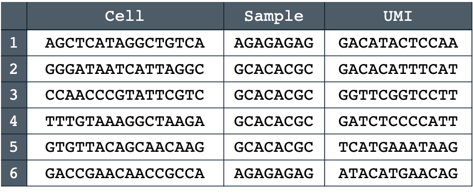
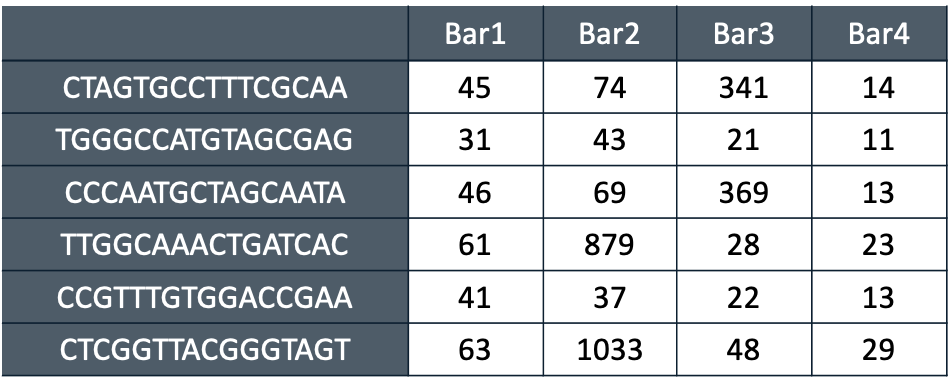
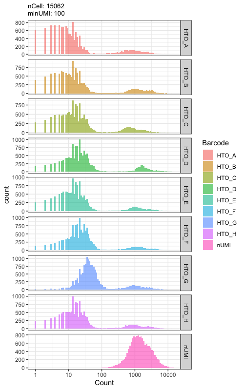
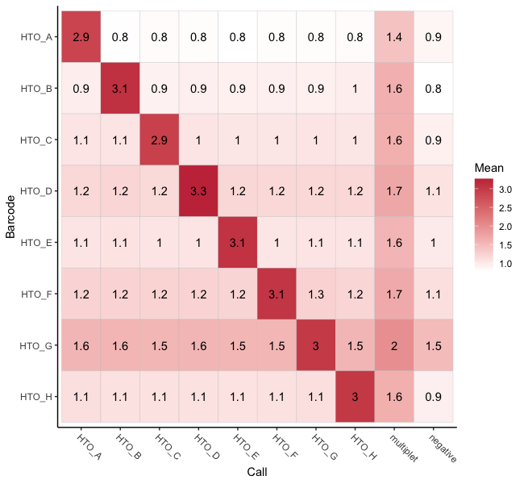

 <br>
by Qin Zhu, Daniel N. Conrad and Zev J. Gartner

**deMULTIplex2** is a mechanism-guided classification algorithm for multiplexed scRNA-seq data that successfully recovers many more cells across a spectrum of challenging datasets compared to existing methods. deMULTIplex2 is built on a statistical model of tag read counts derived from the physical mechanism of tag cross-contamination. Using generalized linear models and expectation-maximization, deMULTIplex2 probabilistically infers the sample identity of each cell and classifies singlets with high accuracy. 

 <br>

## Compatibility

Because of its mechanism-guided design, **deMULTIplex2** is optimized to work with datasets generated from methods that label cells or nuclei with DNA barcodes for pooled processing, including but not limited to: <br>
* [MULTI-seq](https://www.nature.com/articles/s41592-019-0433-8) (2019)
* [Cell Hashing](https://genomebiology.biomedcentral.com/articles/10.1186/s13059-018-1603-1) (2018)
* [CellPlex](https://kb.10xgenomics.com/hc/en-us/articles/360056934011-What-resources-are-available-for-the-3-CellPlex-Kit-for-Cell-Multiplexing) (2021)

## Installation

```
Sys.setenv(R_REMOTES_NO_ERRORS_FROM_WARNINGS="true")

if (!require("devtools", quietly = TRUE))
    install.packages("devtools")  # devtools must be correctly installed to install deMULTIplex2 from github source.

devtools::install_github("Gartner-Lab/deMULTIplex2") # install deMULTIplex2
library(deMULTIplex2) # load deMULTIplex2 into session
```

It is **recommended** (not required) to install ggrastr using `install.packages("ggrastr")`, because summary and diagnostic plots may have a lot of points (cells). deMULTIplex2 will use ggrastr to plot if it is correctly installed. 

## Starting with tag count matrix
**`demultiplexTags()`** is the core function of deMULTIplex2. User must provide a tag count matrix where rows are individual cells and columns represent unique sample tags. You can load an example tag matrix from Stoeckius et al. (2018) by calling `data(stoeckius_pbmc);tag_mtx <- stoeckius_pbmc`. Use `?demultiplexTags` in R to check details. It is **strongly recommended** to pre-filter the matrix to remove majority of the empty droplets for robust classification (See Troubleshooting for details). 

```
tag_mtx <- tag_mtx[cell_barcodes, ] 
res <- demultiplexTags(tag_mtx, # Required, the tag count matrix from your experiment, can be either dense or sparse
                       plot.path = "~/", # Where to output a summary plot
                       plot.name = "test", # text append to the name of the summary plot file
                       plot.diagnostics = FALSE) # Whether to output diagnostics plots for each tag
                       # set plot.umap = "none" to not produce any plots
table(res$final_assign)
```

For 10x Genomics 3’ CellPlex Multiplexing datasets, the latest version of Seurat can grab the CMO matrix from the raw matrix folder:
```
library(Seurat);library(Matrix)
seu1 <- Read10X("lib1/outs/multi/count/raw_feature_bc_matrix/") # Change this to your cellranger output path
tag_mtx <- t(seu1$`Multiplexing Capture`[, cells_pass_filter]) # Strongly suggest define and filter cells using transcriptome prior to demultiplexing
```


## Starting with raw sequencing data (Illumina FASTQs)
Make sure you have your barcode library sequenced and the reads saved in FASTQ format (can be gzipped).
```
~/Experiment2
| Exp2MULTI_S3_L002_R1_001.fastq.gz
| Exp2MULTI_S3_L002_R2_001.fastq.gz
```
Provide **`readTags()`** with the location of the files, the prefix of the FASTQ file names for the library you want to process, and the type of barcode and assay you used. You may also provide a vector of cell barcodes (i.e. from the barcodes.tsv file output by cellranger) to pre-filter your barcode reads. Use `?readTags` in R to check details. 
```
read_table <- readTags(dir = "~/Experiment2",
                       name = "Exp2MULTI",
                       barcode.type = "MULTIseq",
                       assay = "RNA",
                       filter.cells = exp2_cells)
```


Next, **`alignTags()`** will take this read table and count the number of UMIs detected per tag, per cell. Sample tag reads are error-corrected by aligning them to a provided vector of tag sequences used in the experiment. You can manually supply these sequences, or they can be subset from the full vector of MULTI-seq barcodes provided with this package.  Use `?alignTags` in R to check details. 

```
data(multiseq_oligos) # Current MULTI-seq oligo sequence provided with the package
tag.ref <- multiseq_oligos[1:24] # Assuming the first 24 tags are used
tag_mtx <- alignTags(read_table, tag.ref)
```


The produced tag matrix can then be used as input for the `demultiplexTags` function. 

## Visualization tools

```
tagHist(tag_mtx = stoeckius_pbmc, 
        minUMI = 100, 
        plotnUMI = T)
```
 <br>
```
tagCallHeatmap(tag_mtx = stoeckius_pbmc, 
               calls = res$final_assign)
```
 <br>

## Troubleshooting

* Installation failed on macOS - You may need to install Xquartz (https://www.xquartz.org/) first.

* `demultiplexTags` function works best when most empty droplets/beads are removed. Consider using the transcriptome umi count, detected gene, or total tag umi count (not recommended) to determine which barcodes are cells. For maximal cell recovery, you can lower the cutoff to include some low quality cells and beads, and run deMULTIplex2 on the data to determine which are the labeled cells. In practice, we found as long as barcodes representing empty droplets/beads do not exceed 50% of the input data, deMULTIplex2 can properly fit the model and classify cells.

## Cite deMULTIplex2

Zhu Q, Conrad DN, & Gartner ZJ. (2023). deMULTIplex2: robust sample demultiplexing for scRNA-seq. bioRxiv, 2023.04.11.536275. https://doi.org/10.1101/2023.04.11.536275 

## License

This work is licensed under the Creative Commons Attribution-NonCommercial-NoDerivatives 4.0 International License. To view a copy of this license, visit http://creativecommons.org/licenses/by-nc-nd/4.0/ or send a letter to Creative Commons, PO Box 1866, Mountain View, CA 94042, USA.


